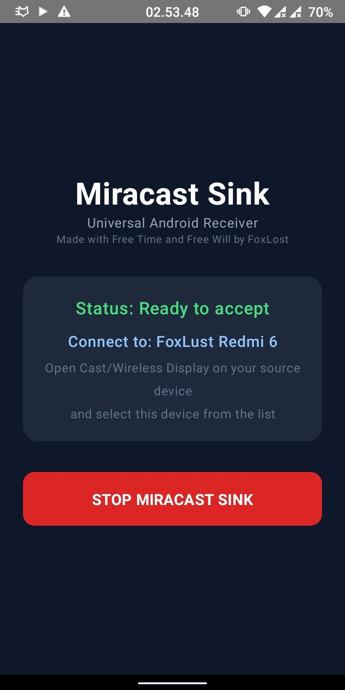
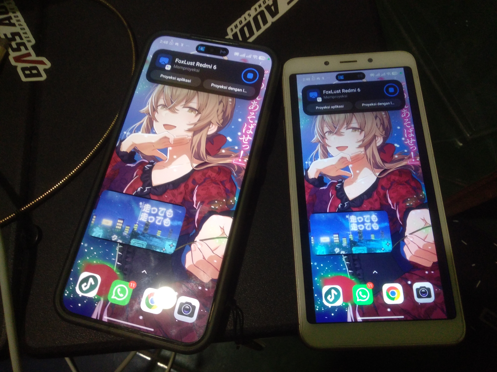

# Universal Miracast Sink

A system-level Miracast (Wi-Fi Display) receiver for Android 10+, deployed as a privileged system app via Magisk. Turns any Android device into a wireless display sink.

**Current version**: v1.3 (versionCode 4)

## Screenshots

| Dashboard | Streaming |
|-----------|-----------|
|  |  |

## Architecture

```
MainActivity (Jetpack Compose Dashboard)
    |
    v
MiracastService (Foreground Service)
    |-- P2pManager ----- P2P discovery, WFD IE injection, group management
    |   |-- P2pReceiver ---- BroadcastReceiver for P2P state changes
    |   `-- SupplicantWriter - Root-level wpa_supplicant DGRAM injection
    |
    |-- RtspServer ------ Inbound RTSP server on port 7236
    |   `-- RtspConnection -- Per-connection RTSP handling
    |
    |-- startRtspHandshake() -- Sink-to-Source RTSP client (WFD M1-M7)
    |
    `-- PlayerActivity -- Media playback (immersive fullscreen)
        |-- RtpReceiver ---- UDP RTP packet reception
        |-- TsDemuxer ------ MPEG-TS demux (H.264 video + LPCM audio)
        `-- MediaDecoderPipeline -- HW H.264 decoder + AudioTrack
```

## Protocol Flow

```
Source Device                             Sink (This App)
-------------                             --------------
1. P2P Discovery -> WFD IE in beacons
2. GO Negotiation -> P2P Group forms
                                          3. TCP connect to source:7236
   M1: OPTIONS * RTSP/1.0 ---------->    4. Respond 200 OK + Public: GET_PARAMETER,SET_PARAMETER
                                          5. Send OPTIONS (sink M2)
   <----------------------- 200 OK        6. (Public: SETUP,PLAY,TEARDOWN,PAUSE,GET_PARAMETER,SET_PARAMETER)
   M3: GET_PARAMETER ------------->      7. Respond 200 OK + sink capabilities
   M5: SET_PARAMETER (caps+trigger) ->    8. Respond 200 OK
                                          9. SETUP rtsp://source/wfd1.0/streamid=0
   <--------------- 200 OK Transport      10. (client_port=15550, server_port=1902)
                                          11. PLAY rtsp://source/wfd1.0/streamid=0
   <------------------- 200 OK            12. RTP streaming begins
   ...                                    ...
   SET_PARAMETER (TEARDOWN trigger) ->    13. Stop playback, clean up
```

## Technical Details

| Property | Value |
|---|---|
| Package | `foxlost.miracast.sink` |
| UID | 1000 (system), via `sharedUserId="android.uid.system"` |
| Signing | AOSP platform key (system certificate) |
| Deployment | Magisk module at `/system/priv-app/MiracastSink/` |
| WFD IE | `00060151001C4432` (Primary Sink, max throughput 50 Mbps) |
| RTSP port | 7236 TCP |
| RTP ports | 15550 (video), 15551 (audio) — UDP |
| Video | H.264 hardware decoder |
| Audio | LPCM 48kHz 2ch 16-bit, big-endian to little-endian conversion |

## Build and Deploy

```bash
# Build
cd universal-miracast-sink
./gradlew assembleDebug

# Sign with platform key
apksigner sign --ks <platform.keystore> --ks-key-alias platform \
    app/build/outputs/apk/debug/app-debug.apk

# Package and flash
cp app/build/outputs/apk/debug/app-debug.apk \
    magisk-miracast-sink/system/priv-app/MiracastSink/MiracastSink.apk
cd magisk-miracast-sink
zip -r ../magisk-miracast-sink-system.zip .
```

Flash the resulting zip via Magisk and reboot.

### Cache Invalidation

When upgrading via Magisk mount, old caches are not automatically invalidated. Always bump `versionCode` and clear caches before reboot:

```bash
su -c 'rm -rf /data/system/package_cache/*/MiracastSink-*'
su -c 'rm -f /data/dalvik-cache/arm*/system@priv-app@MiracastSink@MiracastSink.apk@classes.*'
su -c 'rm -f /data/user/0/com.android.launcher3/databases/app_icons.db*'
```

The `customize.sh` in the Magisk module does this automatically on flash.

## Requirements

| Component | Purpose |
|---|---|
| Root + Magisk | System app deployment, iptables, root scripts |
| LSPosed (optional) | Alternate permission bypass path |
| Platform signing | `CONFIGURE_WIFI_DISPLAY` permission |
| Android 10+ (API 29+) | `minSdk 29` |

## Packages

| Package | Purpose |
|---|---|
| `foxlost.miracast.sink` | Core: Service, Activities, RTSP handshake |
| `p2p` | P2P/WFD: discovery, WFD IE, supplicant injection |
| `rtsp` | RTSP: server, connection handler, protocol |
| `media` | Media: RTP, MPEG-TS demux, H.264 decode, LPCM audio |
| `uibc` | UIBC: touch input backchannel (experimental) |
| `xposed` | LSPosed: framework permission bypass hooks |

## Logging

```bash
adb logcat --pid=$(adb shell pidof -s foxlost.miracast.sink) | \
    grep -E "MiracastApp|MiracastP2P|MiracastRTSP|MiracastMedia|MiracastUIBC"
```

Log tags: `MiracastApp`, `MiracastP2P`, `MiracastRTSP`, `MiracastMedia`, `MiracastUIBC`
